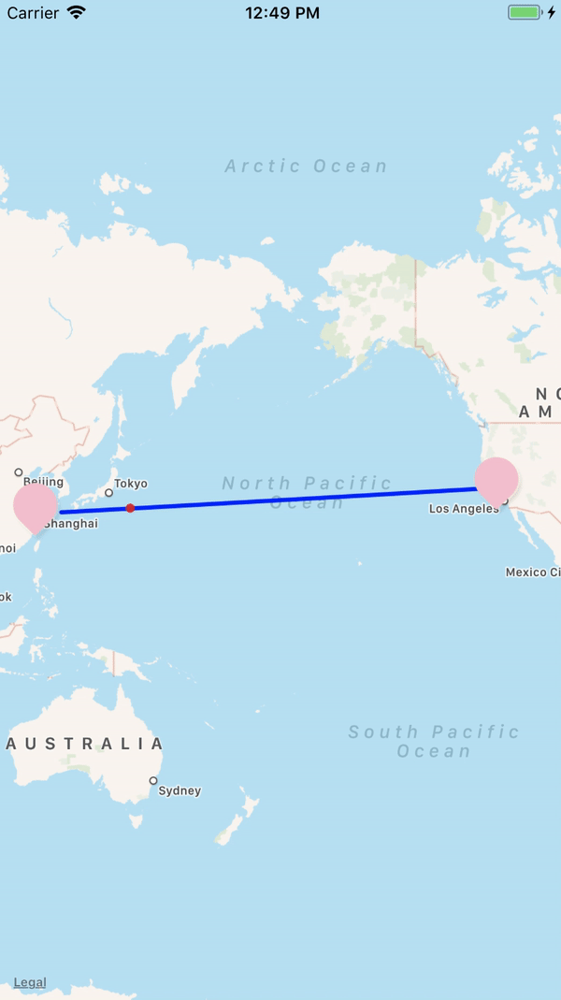

# MapKitPathRenderer

[](https://cocoapods.org/pods/MapKitPathRenderer)
[](https://cocoapods.org/pods/MapKitPathRenderer)
[](https://cocoapods.org/pods/MapKitPathRenderer)


## Features
1. Return points on a Polyline over MapKit between 2 coordinates.

2. Handles Date Line crossing to seamlessly allow animation between coordinates of different continents.

## Example

To run the example project, clone the repo, and run `pod install` from the Example directory first.

## Requirements

## Installation

MapKitPathRenderer is available through [CocoaPods](https://cocoapods.org). To install
it, simply add the following line to your Podfile:

```ruby
pod 'MapKitPathRenderer'
```

## Author

Hem Dutt, hemdutt.developer@gmail.com

## License

MapKitPathRenderer is available under the MIT license. See the LICENSE file for more info.
